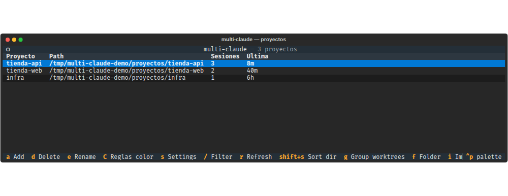
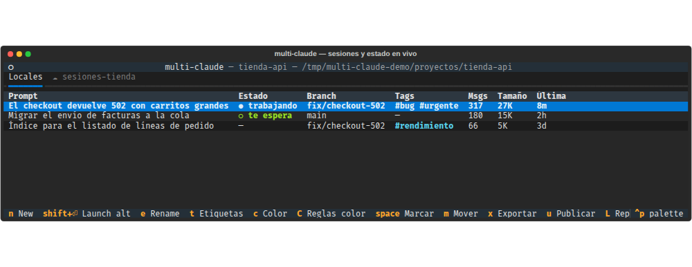
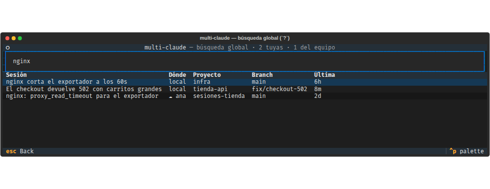
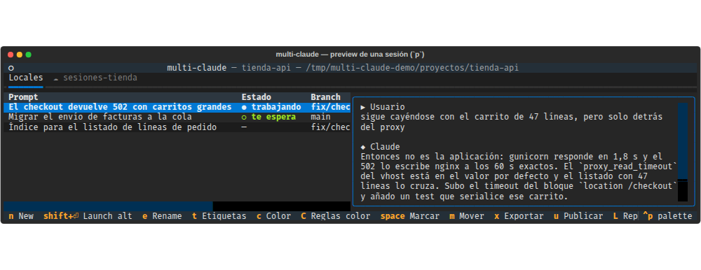
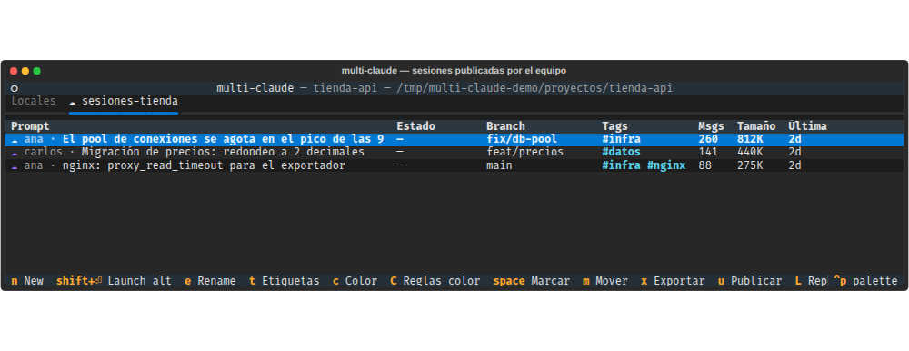

# multi-claude

[](https://github.com/Zarritas/multi-claude/actions/workflows/ci.yml)
[](https://github.com/Zarritas/multi-claude/releases/latest)

A team's shared archive of Claude Code sessions: browse the hundreds of conversations piled up across all your projects — and your colleagues' — and resume any of them from one place.

*[Léeme en español](README.es.md) · the terminal UI itself is in Spanish, as the screenshots show.*


## What it solves

Claude Code stores every session as a `.jsonl` under `~/.claude/projects/<encoded-path>/`. Once you have dozens of projects and hundreds of sessions, finding "that conversation three weeks ago about the X refactor" gets awkward: `claude --resume` only shows the ones for the current cwd, and moving between projects means `cd`s and remembering UUIDs.

And there is a second half to the problem: those conversations belong to **one person and one machine**. The colleague who already fought that deployment has the session on their disk, and all you can do is ask them on Slack for a summary.

`multi-claude` is a terminal dashboard for both. It lists every project with its sessions and lets you organise them as an archive you consult months later — folders, tags, colours, grouped worktrees, search by what was said inside — links each project to one or more sessions repositories the team shares, and on Enter launches `claude --resume <id>` in a new pane or tab of your multiplexer or terminal emulator: yours or someone else's.

### Next to Claude Code's `agent view`

Since 2.1.139 Claude Code ships its own `claude agents`: a panel of the sessions **currently running**, grouped by state, with `/resume` for the repo's history (2.1.212+). For knowing what is happening on this machine right now, that beats any third-party tool — it is the thing producing the data.

multi-claude does not compete there: it reads the same local live-session registry that feeds agent view (see [Live status](#live-status)) and shows that state in the table, so you do not have to look in two places. What it adds on top is what agent view does not do:

- **the history as an organisable archive** — your own folders, tags, rule-based colours, persistent names, worktrees grouped per repo, moving sessions between worktrees;
- **full-text search over the content** of the conversations, not their titles;
- **and the team** — publish a session to a shared repository and resume someone else's, uuid intact.

## What it does

- **Shared sessions** (`L`, `u`): link each project to one or more sessions repositories (GitLab, GitHub or a plain folder), which show up as tabs; publish with `u` and resume a colleague's session with `Enter`, no export/import round trip. And they are searchable **by their content without downloading them** (see [Shared sessions](#shared-sessions-l-and-u)).
- **Credential scan** before publishing: it checks what is about to be uploaded and, if something looks like a credential, the dialogue changes shape so that publishing it is a deliberate act. Suspicious sessions are marked `⚠` in the listing, and `multi-claude --audit-secrets` sweeps the whole history (see [Credential scan](#credential-scan-before-publishing)).
- **Full-text search** (`?`) over the content of every session, on a SQLite FTS5 index — finds "that conversation about the X refactor" by what was said in it, and in the same list **the team's**, marked with who published them (see [Global search](#global-full-text-search-)).
- **MCP server** (`multi-claude-mcp`) over that same index: Claude searches its own past sessions instead of re-deriving what it already solved (see [MCP server](#mcp-server-multi-claude-mcp)).
- **Grouped worktrees** by default: worktrees of one repo collapse into a single row, with their own screen to step into each.
- **User folders** (`f`) to organise projects into a tree of your own.
- **Tags** (`t`) and per-session **colours** (`c`), with automatic rules by branch, age or activity (`C`).
- **Persistent names** (`e`) for sessions and projects, with Claude's `/rename` and Claude's own generated title as fallbacks (see [Names](#names-e)).
- **Incremental filter** (`/`) with `branch:`, `path:`, `id:`, `tag:`, `author:`, `secrets:` and fuzzy free text.
- **Preview** (`p`) of a session's last turns without resuming it.
- **Move, export and import** sessions between worktrees or into a shareable `.zip` (`m`, `x`, `i`).
- **Live status** for each session, read from Claude Code's registry: with several running at once you see in the same table which one is working and which is waiting on you (see [Live status](#live-status)).
- **No duplicates**: if a session is already open in another terminal, it brings that one to the front instead of opening a second.
- **Delete and clean up** (`d`, `D`) taking every on-disk artefact with them, not just the jsonl.

## Stack

- Python 3.10+
- [Textual](https://textual.textualize.io/) for the TUI
- [rapidfuzz](https://github.com/rapidfuzz/RapidFuzz) for the filter's fuzzy matching
- SQLite (stdlib `sqlite3`, with FTS5) for the index and global search
- Standard library for everything else (no heavy parsing dependencies)

## Behaviour

### Screen 1 — Projects

A `DataTable` with one row per project found in `~/.claude/projects/`.



| Column   | Where it comes from                                                    |
|----------|------------------------------------------------------------------------|
| Proyecto | basename of the real cwd                                               |
| Path     | the real cwd, read from the jsonl's first event (not decoded from the dir name) |
| Sesiones | number of `.jsonl` files in the project directory                      |
| Última   | most recent mtime among the project's `.jsonl` files                    |

- Default order: last activity, descending.
- Orphan projects (the cwd no longer exists on disk) show dimmed and cannot be opened.
- **Git worktrees of the same repo are grouped** into one row (see [Worktrees](#worktrees-g)).
- Projects assigned to a **folder** appear inside it (see [Folders](#folders-f)).

Keys:
- `Enter` — open the project's sessions screen (or the worktrees screen / the folder, depending on the row).
- `a` — add a project by hand, giving its path.
- `e` — rename the project (a local alias; nothing on disk is touched).
- `f` — assign the project to a **folder** (or take it out).
- `g` — toggle between **grouped worktrees** and expanded.
- `i` — **import** a sessions `.zip` exported by someone else; after validating the archive you pick which existing project they land in.
- `L` — link the project to one or more shared **sessions repositories**.
- `m` — **merge an orphan project** onto a live one: moves its sessions and hands over its alias. Only available on orphan rows.
- `d` — delete the project (cascading over all its sessions and on-disk artefacts).
- `C` — edit the **colour rules** (see [Colours](#colours-c-and-c)).
- `/` — filter the list (see [Filter](#filter-)).
- `?` — **global full-text search** over every session's content (see [Global search](#global-full-text-search-)).
- `1`…`4` — sort by name / path / session count / last activity.
- `Shift+S` — reverse the sort direction.
- `s` — open the **Settings** modal.
- `r` — rescan `~/.claude/projects/`.
- `Esc` — clear the filter.
- `Ctrl+Q` — quit.

### Screen 2 — A project's sessions

A `DataTable` with one row per `.jsonl`.



| Column | Where it comes from                                                                   |
|--------|---------------------------------------------------------------------------------------|
| Prompt | the session's name if it has one, otherwise the first `type=user` event with `role=user`, stripped of `<command-message>` / args wrappers |
| Estado | what it is doing right now (see [Live status](#live-status))                            |
| Branch | `gitBranch` from the first event carrying a cwd                                        |
| Tags   | tags you assigned by hand (see [Tags](#tags-t))                                         |
| Msgs   | number of lines in the jsonl                                                           |
| Tamaño | the jsonl's size in KB                                                                 |
| Última | the jsonl's mtime                                                                      |

- Default order: last activity, descending.
- The **name** that replaces the first prompt in the **Prompt** column is the first of these three that exists, in order: the one you set with `e`, Claude's `/rename`, or the title Claude generates on its own (see [Names](#names-e)).

Keys:
- `Enter` — resume this session with the **default launch mode** (`auto` by default: a multiplexer pane, or a tab of the current window if there is no multiplexer).
- `Shift+Enter` — resume with the **alternate mode**, derived from the default (see [Settings](#settings-s)).

> **Sessions already open**: if the session is running in another terminal (registered as live in `~/.claude/sessions/`), `Enter`/`Shift+Enter` will **not** open a duplicate — multi-claude tries to bring the existing terminal to the front (tmux → X11/XWayland via `xdotool`/`wmctrl` → GNOME Wayland via the [Window Calls](https://github.com/ickyicky/window-calls) extension → macOS via System Events). If no strategy applies in your environment (GNOME Wayland without that extension, say), the launch is blocked with a warning instead of opening a second terminal over the same jsonl.
- `n` — new session in this project (default mode).
- `Space` — mark/unmark the current session (multi-selection).
- `p` — show/hide the **preview panel** (see [Preview](#preview-p)).
- `e` — rename the session (a persistent name of multi-claude's own).
- `t` — edit the session's **tags**.
- `c` — assign a manual **colour**; `C` — edit the **colour rules**.
- `y` — copy the session **id** to the clipboard.
- `m` — **move** the selected session(s) to another worktree of the same repo (the main checkout or a sibling worktree). With nothing marked, it moves the current row.
- `x` — **export** the selected session(s) into a single shareable `.zip`. With nothing marked, it exports the current row.
- `u` — **publish** the session(s) to the active tab's repository, no zip in between (see [Shared sessions](#shared-sessions-l-and-u)). Asks for confirmation, showing which files go up.
- `L` — manage the **sessions repositories** linked to this project (add, edit, remove). Each one appears as a tab of the listing.
- `Ctrl+→` / `Ctrl+←` — **switch tab** between the local listing and each linked repository, wrapping around. With no linked repositories they do nothing (the tab bar is hidden).
- `d` — delete the selected session(s) and every on-disk artefact. On a **shared** row it deletes nothing of yours: it **unpublishes** it from the repository.
- `D` — **clean up** by age: pick a threshold and delete the older sessions in one go (live sessions are protected).
- `/` — filter the list (see [Filter](#filter-)).
- `1`…`7` — sort by prompt / status / branch / tags / msgs / size / last activity.
- `Shift+S` — reverse the sort direction.
- `s` — open the **Settings** modal: launch mode (with a preview) and extra flags for `claude`.
- `Esc` / `←` — clear the filter, or go back to the projects screen.
- `r` — rescan the project's sessions.
- `Ctrl+Q` — quit.

### Live status

The **Estado** column says what each session is doing right now, from **two sources** on two cadences, because they cost very different amounts:

| Source | Every | What it adds |
|--------|-------|--------------|
| the per-PID registry (`~/.claude/sessions/<pid>.json`) | **2 s** | interactive sessions, at good latency. It is a handful of small json files |
| `claude agents --json` | **15 s** | the **supported** route: it adds *background* sessions (the ones dispatched from `agent view`, which are not in the per-PID registry) and brings states with a documented vocabulary |

The second one is on a slow tick deliberately: the command starts a node process and takes **~350 ms** (measured, five warm runs). At the two-second cadence that would mean 350 ms of subprocess every two seconds, forever; what it adds is worth a few seconds of latency, not that. When both sources know a session, the `pid` comes from the registry (that is what is needed to raise a terminal) and the state from `claude agents` (its vocabulary is the documented one).

| Cell            | Meaning                                                          |
|-----------------|------------------------------------------------------------------|
| `○ te espera`   | stopped, waiting for you to reply (`waiting`, `needs input`)      |
| `● trabajando`  | busy (`busy`, `working`)                                         |
| `· libre`       | alive and ready for the next prompt (`idle`)                      |
| `✓ terminada`   | the task finished cleanly (`completed`)                           |
| `✗ falló`       | it ended in an error (`failed`)                                   |
| `■ detenida`    | you stopped it by hand (`stopped`)                                |
| `● abierta`     | alive, in a state multi-claude does not know                       |
| `—`             | not running                                                       |

The column is not trying to replace Claude Code's [`agent view`](#next-to-claude-codes-agent-view), which is more complete at that job: it is here so that, while you are searching the archive, you do not have to open another view to know whether the session you are looking at is already running. `2` sorts by status and puts what is waiting on you first.

Two things worth knowing:

- **The vocabulary can grow, and a new value is not interpreted.** `claude agents`' states are documented; the per-PID registry's (`busy`, `waiting`) are not. Anything else shows as `● abierta` rather than being given an invented meaning.
- **It only sees this machine's sessions**: both sources are local, so rows in the [shared sessions](#shared-sessions-l-and-u) tabs always show `—`. If `claude` is not on `PATH`, or is a build without `agents`, the column keeps working off the per-PID registry: you lose the background ones, not the column.

A registry entry that outlived its process (a terminal that died badly) does not count as live: an entry only holds if its PID still exists and — on Linux — if the recorded `procStart` still matches `/proc/<pid>/stat`, so a reused PID cannot pass itself off as the session.

### Names (`e`)

In the **Prompt** column the first prompt is the last resort. If the session has a name, the name is shown, and there are three sources in this order of precedence:

1. **Yours** (`e`), stored in `names.json`. What you chose by hand always wins.
2. **Claude's `/rename`**, which is written inside the jsonl. If there are several, the last one wins.
3. **The title Claude generates on its own** (`ai-title` events in the jsonl), updated as the conversation goes. Last one wins.

Which means most sessions arrive with a readable title without you doing anything; `e` is only needed when you do not like the one there.

### Worktrees (`g`)

Several worktrees of one repo are different cwds and therefore different projects in `~/.claude/projects/`. multi-claude **groups them by default** (`group_worktrees: true`): projects sharing a `git_common_dir` collapse into a single row with the group's aggregated session count and last activity.

- `g` toggles grouped/expanded, and the preference persists.
- `Enter` on a group row opens the **worktrees screen**, listing the individual members; from there `Enter` steps into that worktree's sessions and `e` renames it.

### Folders (`f`)

On top of the automatic grouping per repo, you can organise projects into hierarchical folders of your own (`Work`, `Work/Client A`…). A project belongs to at most one folder.

- `f` on a project assigns it to a folder (or takes it out).
- `Enter` on a folder opens the **folder screen**, with its subfolders and projects. Inside: `n` creates a subfolder, `e` renames, `f` removes a project from the folder, `i` imports a `.zip`, `d` deletes the folder.

The tree is stored in `project-folders.json` (see [State files](#state-files)).

### Global full-text search (`?`)

`?` from the projects screen opens a search screen backed by a **SQLite FTS5** table built over the concatenation of each session's user prompts and assistant text. You type and the results refresh on a background worker (up to 200 rows per source), with columns Sesión / Dónde / Proyecto / Branch / Última.



**Two sources** share the list, and the `Dónde` column tells them apart because they are not searched the same way:

| `Dónde`   | What it is                     | What is searched                                                       |
|-----------|--------------------------------|------------------------------------------------------------------------|
| `local`   | your sessions on disk          | the conversation's **content**                                          |
| `☁ ana`   | a session published by Ana     | also the **content**, once its search payload has been downloaded; until then, only the manifest's metadata |

Being able to search someone else's session by what was said in it **without downloading it** is what the [search payload](#searching-the-teams-sessions-without-downloading-them) is for: one blob per session holding the conversation's text, some 36 times smaller than the transcript. It downloads on its own, in the background, when you open the repository's tab. See [Shared sessions](#shared-sessions-l-and-u).

`Enter` on one of your results takes you to the sessions screen of the project holding it. On one of the team's, it also **opens the tab of the repository that has it**, with the row already on screen: from there `Enter` again fetches and resumes it.

Results are ordered by relevance within each source, yours first: the `rank` of two different FTS tables is not comparable, so they are concatenated rather than interleaved as if there were a common order.

**None of this touches the network.** The team's rows are whatever the last visit to each repository's tab cached: the search screen talks to no remote. Which is why a session a colleague published *after* your last visit to that tab does not show up until you open it again.

The tokenizer is `unicode61 remove_diacritics 2`, so `refactor` finds `refactorización` and accents are irrelevant. The index is a **cache, not the source of truth**: it lives at `$XDG_DATA_HOME/multi-claude/index.sqlite3` (`~/.local/share/...` by default) and if it gets corrupted it is rebuilt on the next scan. Re-listing a remote **replaces** its rows rather than accumulating them, so what someone unpublishes stops being a result.

### Preview (`p`)

`p` on the sessions screen opens a read-only side panel rendering the **last turns** of the session under the cursor (up to 12 turns, reading the jsonl's last 60 lines, with text clipped to 800 characters per message). It is for recognising a conversation without resuming it. Visibility persists in `preview_visible`.



### Filter (`/`)

`/` opens an incremental filter input over the current table. The syntax takes `key:value` constraints mixed with free text:

| Key        | Effect                                                              |
|------------|---------------------------------------------------------------------|
| `branch:`  | substring against the branch                                        |
| `path:`    | substring against the project path                                  |
| `id:`      | substring against the session id                                    |
| `tag:`     | comma-separated list; **every** tag must match                      |
| `author:`  | substring against who published the session (`author:ana`, or the full address) |
| `secrets:` | the [credential scan](#credential-scan-before-publishing)'s verdict: `yes` / `no` / `unknown` |

Anything that is not `key:value` is treated as free text and scored with `rapidfuzz.fuzz.partial_ratio` (threshold 70), so it tolerates typos. Example: `branch:main tag:bug,urgent refacto`.

`author:` answers on both tabs, but a different question on each:

- on a **shared repository's** tab every row has a publisher, so `author:ana` means "of what is published here, Ana's";
- on the **local** tab it means "of the sessions I have on disk, which came from someone else" — the case of one you hydrated from a colleague. The author comes from the published index, loaded in the background, so like the `✓` mark it takes a moment to appear.

`secrets:` answers from what the scan left in the index, so in a freshly opened project it takes a moment to have an answer. It accepts `yes`/`si`/`true`/`1`, `no`/`false`/`0`/`limpias` and `unknown`/`desconocido`/`?`. The three are distinct answers and **`unknown` is not a synonym for `no`**: a session nobody has scanned yet is not a session that came back clean, and folding them together would turn the filter into a claim it cannot make. A value it does not recognise (`secrets:maybe`) lets nothing through, for the same reason.

> Note: `/` filters the rows already on screen. To search **inside the content** of the conversations, use `?` — where the author also works as free text, because the publisher's name goes into the index of the team's sessions.

A key the table on screen cannot answer **lets nothing through**, rather than being ignored: `author:`, `tag:`, `id:`, `branch:` and `secrets:` are properties of a session, so over the **projects** list they filter to zero. And `secrets:` does not apply on a shared repository's tab either: a manifest says nothing about credentials, so only the already-fetched rows would have a verdict — half a list answering and half not is worse than saying the question does not apply. Returning every project would read as "none of these has that author" when what is happening is that the question does not apply at that level.

### Tags (`t`)

Flat, multiple tags per session, for slicing the list with `tag:`. They are normalised to lowercase, inner spaces become `-`, and the reserved characters (`,` and `:`) are dropped so they can never clash with the filter syntax. Stored in `session-tags.json`.

### Colours (`c` and `C`)

Two layers, and the manual one wins:

1. **Manual colour** (`c`) — pick from a palette of 9 and it is pinned to that session in `session-colors.json`.
2. **Rules** (`C`) — patterns evaluated in order; the first match wins. Stored in `config.json`.

Conditions a rule supports (one `when` per rule):

| Condition             | Meaning                                                            |
|-----------------------|--------------------------------------------------------------------|
| `branch=main`         | exact branch (case-insensitive)                                    |
| `branch~=feature/*`   | glob against the branch                                            |
| `prompt~=^/`          | regex against the prompt / displayed name                          |
| `active=true`         | the session is live according to `~/.claude/sessions`               |
| `age<1h`, `age<2d`    | last activity is more recent than the threshold (`s`/`m`/`h`/`d`/`w`) |

### Shared sessions (`L` and `u`)

Publish a session to a common repository and have a colleague resume it with `Enter`, without the
`x` (export) → send the zip → `i` (import) round trip. The session keeps its uuid, so it is
literally the same conversation, not a copy.

It is the main reason this project exists: work with Claude leaves a trail that today dies on the
disk of whoever did it. A sessions repository turns that trail into something the team consults —
who already fought this deployment, how that bug was solved — with the same tools and the same
permissions they already share code with.



It is **off by default**: it has to be set up.

#### Setting it up for a team

1. **An empty repository for the sessions**, on your GitLab or GitHub. Private, and readable only
   by whoever should read those conversations — its permissions *are* the sessions' permissions.
   One per client or per area is reasonable; it does not need initialising.

2. **Each person configures the server once**: `s` → "Sesiones compartidas" tab → "Servidores…" →
   "Añadir". Any name, the provider, the URL, and a token or SSH (see below). **`Ctrl+T` checks
   access before saving**; do not carry on without an OK.

3. **Each person links the project to the repository**: open the project, `L` → "Añadir", pick the
   server by name and give `group/sessions-repo` and the branch. A new tab appears named after the
   repository.

4. **Publish**: land on a session and press `u`. The dialogue lists the files about to go up and
   warns if it finds anything credential-shaped (see
   [Credential scan](#credential-scan-before-publishing)). Review it and confirm. On the `Locales`
   tab the session is then marked `✓`.

5. **Fetch someone else's**: the repository's tab shows other people's sessions with `☁`. `Enter`
   downloads and resumes it as if it were yours.

The link is keyed on the **work repo's `origin`**, not its path, so each person configures it on
their machine yet *hits the same destination* even with the project in a different folder. And all
of a repo's **worktrees** share one link: link one and they are all linked.

#### Servers and authentication

A server is defined once (name, provider, URL, authentication) and then chosen **by name** when
linking each repository: all you give is repo and branch. Fixing a URL or rotating a token fixes
every repository pointing at that server at once.

| Authentication | What it needs | What it implies |
|----------------|---------------|-----------------|
| **SSH** *(recommended)* | nothing new | Uses the keys you already have. No tokens to create or hand out, and **git resolves simultaneous publishes**: if two people publish at once, both sessions survive |
| **Access token** | one token per person per server | Over the REST API. Simpler to start with, but the conflict check ([below](#publishing-over-someone-elses-version)) is what stops the second writer from replacing the first |

> **The SSH user is always `git`**, not your GitHub/GitLab username. In
> `git@github.com:Zarritas/multi-claude.git`, `Zarritas` is part of the *repository*. Change it only
> on self-hosted installs that use something else.
>
> **If your server uses an SSH port other than 22, set it.** Find it in the SSH URL of any of its
> repos: in `ssh://git@git.yourcompany.com:2211/group/repo.git` the port is `2211`. It is common on
> self-hosted GitLab, and it cannot be inferred from the web URL — that answers on 443 regardless.
> With the wrong port the connection test receives *nothing*, which is why the warning suggests
> checking it.
>
> `Ctrl+T` on an SSH server runs `ssh -T` and tells you who you authenticate as
> (`autenticado en git.yourcompany.com:2211 como jesus.lorenzo`), without needing any repository.

You can also publish to a **shared folder** (a network mount, Syncthing) instead of a repository:
there the permissions are the filesystem's, and there is no per-client access control or authorship.
Fine for trying it out; for a team, a private repository is better.

**Tokens are never stored in `config.json`** (that file gets shared and pasted into issues): they go
to `remote-tokens.json`, `0600`, one per server. `$MULTI_CLAUDE_REMOTE_TOKEN` overrides them, so CI
does not have to write a secret to disk. With SSH there is no token to store.

With SSH a working copy of the repo is kept in `~/.cache/multi-claude/repos/`. It is a rebuildable
cache: deleting it loses nothing.

#### The global remote

Settings can also configure a **global** remote, which acts as a fallback for projects with no links
of their own. A project's own links win outright: a project linked to a client's repository does
**not** also publish to the global one. Turn it off by choosing "Desactivado" in its dialogue.

#### Tabs and marks

`Locales` shows your sessions; each `☁ name` is a view of the repository: **everything published
there**, with its author and the state of your copy. The bar is hidden when nothing is linked.

On a repository's tab:

| Mark | Meaning |
|------|---------|
| `☁` | Published, you do not have it locally. `Enter` fetches and resumes it |
| `✓` | Fetched and up to date with what is published |
| `↻` | Fetched, but someone continued it afterwards: **there is a newer version** |
| `↑` | Fetched and continued by you: **you have unpublished turns** |

On `Locales`, the same vocabulary seen from the other side:

| Mark | Meaning |
|------|---------|
| (no mark) | Only yours, not in any repository |
| `✓` | Published and up to date. If someone else uploaded it, that is shown: `· de ana` |
| `↻` | The repository has a newer version than your copy |
| `↑` | You have turns you have not published |

The state is computed by comparing your `.jsonl`'s size with the one the manifest records: since a
transcript only grows, any difference is real content. Repositories are queried in the background,
so the list appears instantly and the marks are painted as they arrive; if a repository does not
answer you lose that mark, not the listing.

#### Keys

- `L` — manage the repositories linked to this project (add, edit, remove). Available both on the
  projects screen and inside a project.
- `u` — publish the current row, or every row marked with `Space`. The dialogue asks for
  confirmation and, with several linked repositories, **lets you pick which** (starting from the tab
  you are on). It shows **the exact list of files** leaving the machine.
- `Enter` on a shared row — if you do not have it (`☁`), it downloads it preserving its uuid and
  resumes it; if you do, it resumes your local copy. It warns before launching if the session was
  recorded against a different commit, or if your copy is behind the published one.
- `d` on a shared row — **unpublish it**: removes it from the repository for everyone. Your local
  copy is untouched, and the dialogue says so. On `Locales`, `d` still deletes the session from your
  disk.

On a shared row the local actions (rename, tag, move) are hidden: there is no jsonl to touch yet.

#### What travels and what does not

It uploads the `<uuid>.jsonl`, the `subagents/` (in a fan-out session that is most of the work) and
the `tool-results/`. It does **not** upload the project's `memory/` — that is your personal
auto-memory — nor anything named `session-env`.

#### Before using it in earnest with a team

- **Review the file list when publishing.** The transcript drags the `tool-results/` along, so a
  session that once printed a `.env` or a log with credentials **would publish it**. The
  [credential scan](#credential-scan-before-publishing) checks that before the dialogue opens, but it
  is a heuristic safety net, not a clearance.
- **The code does not travel.** Your colleague needs the work repository, and if it is on a different
  commit the conversation describes files that are no longer those. Resuming warns about the
  divergence, which is what makes it visible rather than surprising.
- **Republishing over someone else's version is blocked.** If someone published on top since you
  fetched your copy, the publish stops before writing and the dialogue explains both sides (see
  [Publishing over someone else's version](#publishing-over-someone-elses-version)). It can be
  replaced on purpose, never by accident.
- **A session you fetched and someone else then continued cannot be updated.** The `↻` mark shows
  it, but pulling those new turns needs a merge that is not implemented yet.

Full design and the pending phases in [docs/REMOTE-SESSIONS.md](docs/REMOTE-SESSIONS.md).

### Publishing over someone else's version

The remote keeps **one manifest per session id**, so publishing a session a colleague has published
on top of would replace theirs. Over SSH git refuses the push and the retry lands on top of theirs,
but over the REST API there is no equivalent: the second writer wins. That is the only operation in
the whole flow that can **lose** work.

The check has the same shape as a git fast-forward. Each machine records which published version its
copy derives from — when the session is fetched, and when it is published successfully — and that is
compared against the remote's manifest before uploading:

| Situation | What happens |
|-----------|--------------|
| not published yet | it publishes; there is nothing to replace |
| the remote still carries the version you started from | fast-forward: it publishes without asking |
| the remote carries a different one | **it stops before writing** and the dialogue explains |

In the third case nothing is uploaded. The dialogue shows both sides — how many messages yours has,
how many the publisher's — and offers two ways out: cancel (which has the focus, because it is the
safe answer) or **replace on purpose**, which is sometimes right. To keep both versions the route is
Claude Code's own: resume with `--fork-session`, which gives it a new uuid, and publish that fork —
the manifest records in `forked_from` where it came from.

**Why sizes are not compared.** A jsonl only grows, so "mine is bigger than the published one" is
equally true when the other person changed nothing and when they added a hundred turns after you
fetched it. The version stamp separates those two; a size cannot.

### Searching the team's sessions without downloading them

Publishing uploads, on top of the transcript, a **search payload**: `search/<uuid>.txt.gz`, holding
the conversation's text and nothing else. That is what lets `?` find a colleague's session by a
phrase said inside it, without fetching the whole session.

Three decisions behind it:

- **It lives in its own blob, not in the manifest.** Listing a tab reads *every* manifest, so half a
  megabyte of text per session would turn opening a tab into a multi-megabyte download (and, on the
  REST backends, into an enormous response per session). Kept apart it is downloaded once per
  session, on demand.
- **It is small**: measured over 35 real sessions, the payloads compress to 0.5 MB against 18.5 MB
  for the same transcripts — **36 times less** to be able to search them. The largest was 126 KB
  compressed, for a 3.9 MB session.
- **It is the same text the local search indexes**: prompts and replies, no tool calls and no tool
  output. That is what keeps it small and, at the same time, keeps the likeliest home of a stray
  credential — a command's output — out of what gets uploaded for searching.

The download runs in the background when the tab is opened, up to 25 sessions per visit (a
repository with hundreds fills in over several visits instead of stalling one), and it does not
repeat what is already indexed. If someone **republishes** a session the cached text is invalidated
and fetched again; if someone **unpublishes** it, it disappears from search.

The **manifest goes to version 2** to announce that the payload exists (`search_bytes`). v1
manifests are still read: those sessions simply have no payload and stay searchable by metadata,
which is what they always were. An unknown *future* version is still refused.

### Credential scan before publishing

A transcript drags along everything the conversation touched: the `Bash` that printed a `.env`, the
`cat` of a private key, the token you pasted into a prompt. Publishing that to a repository the whole
team reads is the failure most likely to get the feature banned in an organisation, so what is about
to go up is checked before the dialogue opens.

It recognises PEM private keys, provider-prefixed tokens (GitHub, GitLab, Anthropic, OpenAI, Slack,
Google, Stripe, AWS), JWTs, credentials inside a URL, `Authorization` headers, and assignments whose
**name** suggests a credential *and* whose **value** looks like one.

With findings, the dialogue does not merely say so: it **changes shape**.

- The warning turns red and heads the dialogue, followed by **what to rotate**: one row per issuer,
  with a **clipped** excerpt, how often it turns up, where, and the action — because "a GitHub token"
  is only useful once it also says "revoke it in GitHub's access tokens".
- Focus starts on **Cancelar**, and the publish button reads "Publicar de todas formas".
- **`Enter` stops publishing.** The failure this guards against is pressing Enter on autopilot, so
  with findings on screen Enter presses the focused button (Cancelar) and reaching the other one is
  deliberate.

Four decisions worth knowing:

- **The value found is never printed.** A scanner that writes the secret into a dialogue — and from
  there into a screenshot, a scrollback or a bug report — has leaked it a second time. Only the first
  characters, the last two and the length come out.
- **A finding warns, it does not veto.** Over free conversation text false positives are inevitable,
  and a scanner that prevents publishing teaches people to route around it. The friction is
  deliberate; the decision stays with the person.
- **The same value repeated is one finding, not a hundred.** A key printed by a command that ran
  seventy times is listed once, with the number of occurrences — otherwise it buries everything else.
- **Rows group by issuer, and each one says what to do.** Seven rows reading "token de GitHub" at
  seven line numbers answer a question the reader has already answered; the one still open is *what
  do I have to rotate*. And the dialogue states the thing that is usually understood backwards:
  **cancelling does not make the credential safe** — it has been in plain text on your disk since the
  conversation happened, and what disables it is rotating it. Cancelling only keeps it out of the
  repository's git history, where deleting it later does not remove it. When the issuer is not
  recognisable (the generic rule, which fires on a variable's *name*) the row admits that instead of
  inventing advice.

#### Sweeping the whole history, not just what you publish

Keeping a key out of the team's repository is half the problem. The other half is that it is
**already in plain text on your disk**, published or not, and that is fixed by rotating it:

```bash
multi-claude --audit-secrets              # the whole history
multi-claude --audit-secrets --project ~/work/api
multi-claude --audit-secrets --verbose    # with a clipped excerpt per finding
```

It prints, per affected session, its id, its title, its project, and **one row per issuer** — the
same grouping the dialogue uses — with where it turned up. And it ends with the list that answers
what a sweep is really asking, *what do I have to rotate on this machine*:

```
Qué habría que rotar (3):
  · token de GitHub — en 2 sesiones
    ↻ revócalo en los tokens de acceso de GitHub
  · credenciales en una URL — en 1 sesión
    ↻ cambia la contraseña del servicio al que apunta
  · asignación con nombre de secreto — en 1 sesión
    ↻ sin emisor reconocible: abre la línea y decide qué es
```

Aggregated **across sessions**, because that is the scale the action happens at: one key pasted into
six conversations is one token to revoke, and six rows spread over six sessions is the shape that
hides it. Which is why the action appears once at the end rather than in every session. What that
block does **not** state is how many distinct values there are: within a session the scan dedups by
value, but across sessions it cannot, so the same key seen in four sessions would add up to "4
distintas" and send someone to rotate four things where there is one. The number of sessions can be
claimed truthfully; the number of keys cannot.

**It exits 1 when it finds something**, so it works in a hook or a `cron`. Without `--verbose` it
shows not even the masked excerpts, so the output can be pasted into a ticket; the **title is
redacted too**, because a title is the first prompt and that is where a pasted token ends up.

It also leaves the result in the index, which is what feeds the listing's mark:

#### The `⚠` mark in the listing

A session with possible credentials carries `⚠` before its name on the sessions screen, ahead of the
shared mark: the question it answers — should this leave the machine at all? — comes before "has it
already". And `/secrets:yes` isolates exactly those (see [Filter](#filter-)).

The scan runs in the background and is cached in the index against the jsonl's `mtime`, so the first
visit to a large project computes it and later ones are free. A session that has grown since its scan
is looked at again, because the credential may be in the new part. And **an unscanned session neither
carries the mark nor lacks it**: the absence of `⚠` means "scanned and clean" only after the scan has
run.

The rules are calibrated against 60 MB of real transcripts: the first version raised 714 warnings
(names like `input_tokens`, `tokenize`, or the `\tPassword:` of a `grep -n`), and a version like that
is worthless because it gets ignored. Requiring that the name carry no letter suffix and that the
value look like a credential, the same material yields 10 unique findings in 7 of 33 sessions. If you
touch the rules, measure again: `tests/test_secret_scan.py` covers both what it must catch and what
it must **not**.


## How Claude gets launched

`launcher.launch_claude(cwd, session_id=None, *, mode="auto", claude_args=None)` decides **where** the
session lands. Each mode degrades to the next when its destination is unavailable:

| Mode      | Dispatch chain                                                        |
|-----------|-----------------------------------------------------------------------|
| `auto`    | multiplexer pane → tab → new window → suspend the TUI                 |
| `split`   | multiplexer pane → tab → new window → suspend                         |
| `tab`     | tab in the current window → new window → suspend                      |
| `window`  | new emulator window → suspend                                         |
| `suspend` | always suspend the TUI (`app.suspend()` + `subprocess.run`)            |

When it degrades, the TUI says so with the reason (`kitty` without remote control, an emulator with no
CLI tabs, etc.) instead of doing it silently.

**Multiplexers** (they take priority because they nest inside the emulator):

| Environment            | Pane (`split`)                                | Tab (`tab`)                          |
|------------------------|-----------------------------------------------|--------------------------------------|
| `$TMUX`                | `tmux split-window -h -c <cwd> claude ...`     | `tmux new-window -c <cwd> claude ...` |
| `$ZELLIJ`              | `zellij action new-pane --cwd <cwd> -- ...`    | a pane (zellij takes no command for a tab) |
| `$TERMINATOR_UUID`     | `remotinator vsplit -x "cd <cwd> && exec claude ..."` ¹ | `terminator --new-tab ...` |

¹ `remotinator` ships with Terminator and talks to its DBus API: `vsplit` splits the terminal of
`$TERMINATOR_UUID` into two columns, like `tmux split-window -h`. It can only inherit the directory of
the terminal it splits, hence the command carrying its own `cd`. If `remotinator` is not on `PATH` or
Terminator's DBus is off (`terminator -u`), the session falls back to a tab and the TUI says so.

**Emulators** (detected via `$TERM_PROGRAM`, env vars and the binary on `PATH`):

| Emulator          | New window                                                  | Tab in the current window                              |
|-------------------|-------------------------------------------------------------|--------------------------------------------------------|
| kitty             | `kitty --directory <cwd> claude ...`                        | `kitty @ launch --type=tab --cwd <cwd> -- claude ...` ² |
| WezTerm           | `wezterm start --cwd <cwd> -- claude ...`                   | `wezterm cli spawn --cwd <cwd> -- claude ...`           |
| GNOME Terminal    | `gnome-terminal --window --working-directory=<cwd> -- ...`  | `gnome-terminal --tab --working-directory=<cwd> -- ...` |
| Konsole           | `konsole --workdir <cwd> -e claude ...`                     | `konsole --new-tab --workdir <cwd> -e claude ...`       |
| Terminator        | `terminator --working-directory=<cwd> -x claude ...`        | `terminator --new-tab ...`                             |
| Windows Terminal  | `wt.exe -w -1 new-tab -d <cwd> -- claude ...`               | `wt.exe -w 0 new-tab -d <cwd> -- claude ...`           |
| iTerm2 (macOS)    | `osascript` → `create window with default profile`          | `osascript` → `create tab with default profile`         |
| Ghostty           | `ghostty +new-window --working-directory=<cwd> -e claude ...` ³ | — (no tab IPC; see ⁴)                              |
| Alacritty         | `alacritty --working-directory <cwd> -e claude ...`         | — (no tabs)                                            |
| foot              | `foot --working-directory=<cwd> claude ...`                 | — (no tabs)                                            |
| Apple Terminal    | `osascript` → `do script "cd <cwd> && exec claude ..."`     | — (would need synthesising ⌘T via System Events)        |
| x-terminal-emulator / xterm | `<term> -e sh -c "cd <cwd> && exec claude ..."`   | —                                                      |

² Needs `allow_remote_control` in `kitty.conf`. If it fails, a new window opens and you are told.

³ `+new-window` asks the already-running instance for the window (D-Bus, GTK/Linux only) instead of
starting a second process. It exits non-zero if it cannot reach it — or if your Ghostty predates the
action — and then falls back to `ghostty --working-directory=<cwd> -e claude ...`. On macOS Ghostty
refuses to launch the emulator from its own CLI and implements no IPC, so there it uses
`open -na Ghostty.app --args --working-directory=<cwd> -e claude ...`.

⁴ Ghostty exposes only two IPC actions, `new_window` and `toggle_quick_terminal`; there is no
`+new-tab` or `+new-split` and upstream closed the request as *not planned*
([#12136](https://github.com/ghostty-org/ghostty/issues/12136)). Its per-window D-Bus actions
(`win.new-tab`, `win.split-right`) take neither a directory nor a command, so they cannot carry a
`claude --resume`. For panes and tabs inside Ghostty, put tmux or zellij underneath.

Emulator detection, in order:

1. `$TERM_PROGRAM` (the canonical one; Ghostty, WezTerm… publish it).
2. An emulator-specific env var (`$KITTY_PID`, `$GHOSTTY_RESOURCES_DIR`, `$ALACRITTY_LOG`, `$WT_SESSION`, etc.).
3. Generic fallback: `x-terminal-emulator` or `xterm` if on `PATH` (POSIX).

Emulators that are detectable but not CLI-controllable (VS Code, Warp, Tabby, ConEmu) fall back to
inline execution with the reason given. If nothing is detected, the TUI suspends as a last resort.

### Extra arguments for `claude`

`claude_args` (configurable in Settings) goes ahead of the flags the TUI manages:

```
claude <your flags> --resume <id> -n <name>
```

Useful for `--dangerously-skip-permissions`, `--model`, `--effort`, `--add-dir`, `--ide`… The flags
multi-claude needs to control (`--resume`, `-c`, `-n`, `-p`, `--bg`, `--from-pr`) are rejected with an
error in the modal rather than colliding with the session being resumed.

## Settings (`s`)

The modal is split into tabs:

| Tab | What it configures |
|-----|--------------------|
| **Lanzamiento** | where the session opens on Enter, and extra arguments for `claude` |
| **Sesiones compartidas** | the **servers** (name, provider, URL, token or SSH) and the **global remote** |
| **Colores** | the automatic colour rules |

A TUI modal with:

- **Enter (default)** — where the session opens (`auto`, `split`, `tab`, `window`, `suspend`). Below it
  a diagram of the selected mode is drawn, plus a *"Aquí y ahora: …"* line that dry-runs what that mode
  would do in your particular terminal.
- **Skip permissions** — a checkbox for `--dangerously-skip-permissions`.
- **Arguments for `claude`** — the remaining extra flags, in command-line form.

Only the **default** is configured. The **alternate** (Shift+Enter) is derived automatically:

| Default   | Alternate (Shift+Enter) |
|-----------|-------------------------|
| `auto`    | `suspend`               |
| `split`   | `window`                |
| `tab`     | `window`                |
| `window`  | `suspend`               |
| `suspend` | `window`                |

Persisted at:
- **Linux/macOS**: `~/.config/multi-claude/config.json` (or `$XDG_CONFIG_HOME/multi-claude/config.json` when set).
- **Windows**: `%APPDATA%\multi-claude\config.json` (typically `C:\Users\<user>\AppData\Roaming\multi-claude\config.json`).

Besides the mode, the file stores the UI state remembered between runs:

```json
{
  "default_mode": "auto",
  "claude_args": ["--dangerously-skip-permissions"],
  "projects_sort": { "key": "last_activity", "descending": true },
  "sessions_sort": { "key": "last_activity", "descending": true },
  "preview_visible": true,
  "group_worktrees": true,
  "color_rules": [],
  "remote_servers": [
    { "name": "FactorLibre", "kind": "gitlab", "host": "https://git.factorlibre.com",
      "auth": "ssh", "ssh_user": "git", "ssh_port": 2211 }
  ],
  "remote_kind": "none",
  "remote_server": "",
  "remote_repo": "",
  "remote_branch": "main",
  "remote_path": ""
}
```

The loose `remote_*` keys are the **global remote**; `remote_servers` is the catalogue of servers.
Per-project links live separately in `project-remotes.json`, and tokens in `remote-tokens.json` —
never here.

A missing, corrupt or invalid `config.json` falls back to these defaults silently — it is never fatal.

> A note on `Shift+Enter`: most modern emulators transmit it differently from `Enter`, but some older
> ones do not — in that case `Shift+Enter` simply does what `Enter` does. If that happens to you,
> change the default in Settings so both keys do what you want.

## MCP server (`multi-claude-mcp`)

The FTS5 index behind global search (`?`) does not have to be queried by hand only.
`multi-claude-mcp` puts it behind an MCP server, so **Claude can search its own past work**: instead
of re-deriving how that GitLab SSH port got sorted out, it finds the conversation where it was — from
any project, including one it has never had in context.

Register it once:

```bash
# for all your projects
claude mcp add multi-claude --scope user -- multi-claude-mcp

# or just for the current project
claude mcp add multi-claude -- multi-claude-mcp
```

And from then on, inside any session: *"had we already fought this repo's SSH auth?"*.

> Coming from an earlier version, `multi-claude-mcp` is a new command and does not appear until you
> reinstall (`uv tool upgrade multi-claude`, or `uv pip install -e .` in a checkout). Meanwhile the
> module works the same invoked by hand: `claude mcp add multi-claude -- python -m multi_claude.mcp`.

### The tools it exposes

| Tool | What it does |
|------|--------------|
| `search_sessions` | full-text search over the **content** of all your indexed sessions; optionally scoped to a `project_path` |
| `search_team_sessions` | the sessions the team published: by **content** once their search payload is downloaded, and by the manifest's metadata until then |
| `get_session` | a session's metadata and its last N turns, to read it without resuming |
| `list_projects` | the projects with history on this machine, with their real path and session count |
| `refresh_index` | populates the index; only needed when `search_sessions` misses something that is on disk |

### Decisions

- **Read-only.** No tool moves, deletes, publishes or renames anything. The only thing it writes is
  multi-claude's own index cache.
- **No MCP SDK.** The protocol's stdio transport is newline-delimited JSON-RPC 2.0, so it is `json`
  and the stdlib: a few hundred lines in `mcp.py` instead of the SDK's dependency tree, consistent
  with the rest of the project. Protocol version is negotiated (the client's is echoed when we know
  it, ours offered when we do not) and protocol errors (`-32602` and friends) are kept distinct from
  execution failures (`isError` inside the result), as the spec requires.
- **Text, not JSON.** The tools return readable text rather than `structuredContent`: the consumer is
  a model, and duplicating the payload as serialised JSON would only spend tokens.
- **The index populates itself the first time.** Since it is written when you *enter* a project in the
  TUI, a fresh install would have nothing to search; the first search over an empty index scans
  everything and says so in the answer (measured: 1.2 s for 34 sessions, 65 MB of jsonl). Later ones
  are milliseconds.
- **A deleted session is not offered.** The index is a cache that is never purged, so it outlives the
  sessions it describes; results whose jsonl is no longer on disk are dropped before answering, rather
  than handing back an id `get_session` could not open.

> **Privacy**: this gives the model read access to the content of your past conversations, which is
> exactly the point — but a session that once printed a `.env` or a token has it inside its jsonl, and
> therefore in the index. It is the same material already on your disk and it does not leave the
> machine, but it is worth knowing that it enters context.

For the team's sessions, `search_team_sessions` is deliberately a separate tool rather than a flag on
the other: what it returns is still not comparable — these are sessions that have to be downloaded
before `get_session` can read them, and their coverage depends on the search payload already being
fetched — and mixing them would invite the model to treat as searched a conversation nobody has
indexed.

## State files

Everything multi-claude stores on its own (it never writes inside Claude's jsonl files). Paths respect
`$XDG_CONFIG_HOME` / `$XDG_DATA_HOME` when set, with `%APPDATA%` on Windows for the config:

| File | Contents |
|------|----------|
| `~/.config/multi-claude/config.json`          | preferences (mode, sort, preview, grouping, colour rules) |
| `~/.config/multi-claude/names.json`           | persistent session names (`e`)                       |
| `~/.config/multi-claude/session-tags.json`    | per-session tags (`t`)                               |
| `~/.config/multi-claude/session-colors.json`  | manual per-session colours (`c`)                     |
| `~/.config/multi-claude/project-folders.json` | the folder tree and project assignments (`f`)        |
| `~/.config/multi-claude/project-remotes.json` | sessions repositories linked to each project (`L`), keyed by the repo's `origin` |
| `~/.config/multi-claude/remote-tokens.json`   | one token per server, `0600`                         |
| `~/.local/share/multi-claude/index.sqlite3`   | SQLite index + FTS5 tables for your sessions and for each shared repository's last listing (rebuildable cache) |
| `~/.cache/multi-claude/repos/`                | working copies of the SSH sessions repositories (rebuildable cache) |

Deleting any of them is safe: you lose that state, not the sessions. `remote-tokens.json` is the only
one holding a secret, which is why it is created owner-only.

## A project's identity

The `~/.claude/projects/<encoded>/` directory name is the original path with `/` replaced by `-`. That
encoding is ambiguous when the original path contained hyphens (`/foo-bar/baz` and `/foo/bar/baz`
collide).

**Source of truth**: the `cwd` field of the first `type=user` event of the project's first `.jsonl`.
Only when no jsonl is parseable does it fall back to the `-` → `/` heuristic.

`os.path.isdir(cwd)` decides whether the project is live or orphaned.

## Known limitations

- **The index populates in the background at startup**, not when you enter each project: the first run
  after an update costs a moment (0.8 s for 35 sessions where it was measured) and from then on it is
  a few `stat`s. While that first sweep runs, `?` may return less than there is.
- **The FTS payload is capped per session**: at most the jsonl's first 20,000 lines and 512 KB of text
  (`FTS_REINDEX_SCAN_LINES` / `FTS_CONTENT_MAX_CHARS` in `session.py`). That covers the measured
  sessions comfortably — the longest had 7,555 lines — but an extraordinarily long conversation would
  still be clipped at the end. Only user and assistant text goes in: tool calls and their output are
  never indexed, so they cannot be searched.
- **A project moved to a different path**: renaming a project's folder leaves the old and new sessions
  as two separate entries in `~/.claude/projects/`. They are not reconciled automatically — the old one
  stays orphaned and you merge it by hand with `m`.
- **Not every emulator can open tabs from the CLI**: Ghostty (its only IPC actions are `new_window` and
  `toggle_quick_terminal`; upstream closed the CLI-tabs request as *not planned*), Alacritty, foot and
  Terminal.app can only open windows, so in `tab` mode the session ends up in a new window and the TUI
  tells you. For panes or tabs inside Ghostty, put tmux or zellij underneath. On kitty and WezTerm the
  tab needs remote control enabled (`allow_remote_control` in `kitty.conf`); with it off, same fallback.
- **zellij cannot launch a command in a new tab**: `zellij action new-tab` only takes a layout, not a
  command, so `tab` mode inside zellij opens a pane.
- **Live status is this machine's, and a new value is not interpreted**: see
  [Live status](#live-status). A state not in `_STATUS_CELLS` (`screens/sessions.py`) shows as
  `● abierta`.
- **Background sessions take up to 15 s to appear**: only `claude agents --json` knows about them, and
  it is polled on a slow tick because it costs ~350 ms. Without `claude` on `PATH` they do not appear
  at all.
- **Conflict detection depends on having recorded a base**: it is written when a session is fetched and
  when it is published, so a session published by an older multi-claude has no base. In that case it
  only warns when the remote manifest was signed by **someone else**; republishing your own does not
  cost a dialogue, because the only history at stake is yours.
- **A session already fetched cannot be updated**: if a colleague continues it after you fetch it, the
  row shows `↻` but there is no way to pull those turns in. It needs the per-`uuid` merge that is still
  pending.
- **The credential scan is a heuristic, not a guarantee**: it recognises known formats (private keys,
  provider-prefixed tokens, credentials in URLs) and assignments whose name and value both look like a
  credential, but a password dictated in prose or a bespoke format gets past it. It is a safety net,
  not a clearance — see [Credential scan](#credential-scan-before-publishing). Binaries and files over
  8 MB are not checked, and the dialogue says so.
- **Publishing to GitLab/GitHub makes one commit per file**: a session with subagents is several
  commits in the sessions repo, not one. The manifest always goes last, so an interrupted publish ends
  up invisible rather than half-there, but the repo's history is noisier than necessary.
- **A shared session's content becomes searchable once its search payload is downloaded**, which
  happens in the background when you open the repository's tab (up to 25 per visit). Until then — or if
  an older version published it, or if its text was over 512 KB — only the manifest's metadata is
  searched.
- **The team's rows are from the last visit to each tab**: they are cached when you open a repository's
  tab, not in the background, so anything published afterwards does not show in `?` until you open it
  again. That is deliberate — the search screen must make no network calls.
- **The MCP server's first search over an empty index scans the whole history**: 1.2 s for 34 sessions
  (65 MB of jsonl) on the machine where it was measured, but it grows with the history and the work is
  reading and parsing files. If your client were to cut it off on a timeout, run `multi-claude` once
  (or call `refresh_index`) and retry: from then on queries are milliseconds.

## Installation

### Prerequisites

- **Linux** (Ubuntu/Debian/Fedora/Arch tested), **macOS** or **Windows 10/11**.
- **Python 3.10+** (most modern distros ship it; on macOS `brew install python@3.13`; on Windows use
  the official installer or `winget install Python.Python.3.13`).
- **`claude`** (the Claude Code CLI) on `PATH`. Without it `multi-claude` starts but cannot resume
  sessions — the TUI will tell you.
- *(Optional, Linux/macOS)* **`tmux`** or **`zellij`** (or **`terminator`** with its `remotinator`,
  Linux only) so Claude opens in a pane without losing the TUI. Without a multiplexer most emulators
  open a tab in the same window (see [How Claude gets launched](#how-claude-gets-launched)).
- *(Optional)* A supported emulator:
  - **Linux**: kitty, WezTerm, Ghostty, Alacritty, Konsole, GNOME Terminal, foot, Terminator, xterm.
  - **macOS**: **iTerm2** (tabs and windows) or **Terminal.app** (windows only); both via AppleScript
    with `osascript`, which ships with macOS. kitty, WezTerm, Ghostty and Alacritty work too.
  - **Windows**: **Windows Terminal** (`wt.exe`: a tab of the current window in `auto`/`tab` mode, a
    separate window in `window` mode).

  With none of these, the TUI suspends and comes back when you close Claude.

### Step 1 — Install a Python tool manager (if you have none)

Either works; **uv** is the fastest and the only one covering all three platforms with one binary.

**Linux / macOS:**

```bash
# uv (recommended)
curl -LsSf https://astral.sh/uv/install.sh | sh

# or pipx
sudo apt install pipx && pipx ensurepath      # Debian/Ubuntu
brew install pipx && pipx ensurepath          # macOS
```

Close and reopen the terminal so `~/.local/bin` enters `PATH`.

**Windows (PowerShell):**

```powershell
# uv (recommended)
powershell -ExecutionPolicy ByPass -c "irm https://astral.sh/uv/install.ps1 | iex"

# or via winget
winget install --id=astral-sh.uv -e
```

Close and reopen PowerShell (or restart Windows Terminal) so `%USERPROFILE%\.local\bin` enters `PATH`.

### Step 2 — Install multi-claude

One line, nothing to clone — identical on Linux, macOS and Windows:

```bash
uv tool install git+https://github.com/Zarritas/multi-claude.git
# or (Linux/macOS):
pipx install git+https://github.com/Zarritas/multi-claude.git
```

That tracks `main`. To pin a released version instead — which is what you want when you are putting it
on a teammate's machine, so everyone is talking about the same behaviour — add the tag:

```bash
uv tool install git+https://github.com/Zarritas/multi-claude.git@v1.0.0
```

Every tag has a [release](https://github.com/Zarritas/multi-claude/releases) with its notes and a
built wheel attached. There is no PyPI package.

### Step 3 — Run it

```bash
multi-claude
```

You should see the list of your Claude projects. `Enter` steps into one, `Enter` again resumes a
session.

With no arguments it opens the TUI; a few things make more sense on the command line:

```bash
multi-claude --audit-secrets    # sweep the history for credentials (exits 1 if any)
multi-claude --version          # what you have installed — quote it in any bug report
multi-claude --help
```

`--version` prints `1.0.0` for an install from a tag, and something like `1.0.0.dev3+gabcdef0` for one
from a checkout between tags, so the two are never confused.

> **macOS**: the first time multi-claude launches a session in a new iTerm2 / Terminal.app window,
> macOS asks for permission for `osascript` to control those apps (System Settings → Privacy &
> Security → Automation). Accept once and it persists.
>
> **Windows**: in `auto` or `tab` mode sessions open in a tab of the current Windows Terminal window
> (`wt.exe -w 0`); in `window` mode, in a separate window (`wt.exe -w -1`). Outside Windows Terminal
> (`cmd.exe`, ConEmu…) the TUI suspends and `claude` runs inline.

### Upgrading

```bash
uv tool upgrade multi-claude
# or
pipx upgrade multi-claude
```

Both re-resolve from the source you installed from, so an install tracking `main` moves to today's
`main`, and one pinned to a tag stays where it is — move it by reinstalling with the new tag. Check
with `multi-claude --version`.

### Uninstalling

```bash
uv tool uninstall multi-claude
# or
pipx uninstall multi-claude
```

### Installing from a local clone

If you have cloned the repo and want your modified version installed:

```bash
git clone https://github.com/Zarritas/multi-claude.git
cd multi-claude
uv tool install .                       # a snapshot of the current state
# or, so future changes in the repo apply without reinstalling:
uv tool install --editable .
```

### Troubleshooting

- **`multi-claude: command not found`** after installing (Linux/macOS) → `~/.local/bin` is not on your
  `PATH`. `uv` and `pipx` add it to your shell config automatically, but the terminal has to be
  restarted. If it persists, run `uv tool dir --bin` or `pipx environment --value PIPX_BIN_DIR` and add
  that path to `PATH`.
- **`multi-claude` is not recognised as a command** (Windows) → restart Windows Terminal/PowerShell
  after installing. If it persists, check that `%USERPROFILE%\.local\bin` (or whatever
  `uv tool dir --bin` prints) is on your user `PATH`.
- **`claude no encontrado en PATH`** when pressing Enter on a session → install the Claude Code CLI
  following its official guide.
- **macOS asks for Automation permission** the first time you launch a session → that is `osascript`'s
  native prompt to control iTerm2 / Terminal.app. Accept and it will not ask again.
- **Greyed-out (orphan) projects** → the project's original folder no longer exists (you moved or
  deleted the directory). The sessions are still there but cannot be resumed; delete them with `d`.

## Development

```bash
git clone https://github.com/Zarritas/multi-claude.git
cd multi-claude
python -m venv .venv && source .venv/bin/activate
pip install -e ".[dev]"

multi-claude        # start the TUI
pytest              # run the suite
```

See [CONTRIBUTING.md](CONTRIBUTING.md) for the checks CI gates on, how the README images are
regenerated, and the architecture cheatsheet.

## Code layout

```
src/multi_claude/
  __main__.py        # entrypoint: the TUI, plus --audit-secrets
  app.py             # ClaudeBrowserApp(textual.App) — registers screens and stores
  app_protocol.py    # the Protocol screens use to talk to the app
  discovery.py       # scan_projects() → list[Project], WorktreeGroup, ProjectFolder
  session.py         # scan_sessions(project) → list[Session], parsers, FTS payload
  index.py           # SessionIndex — SQLite + FTS5 for your sessions and the team's
  transcript.py      # reading turns out of a jsonl, without Textual (preview and MCP)
  mcp.py             # MCP server over the index: JSON-RPC 2.0 on stdio, no SDK
  secret_scan.py     # looks for credentials in what is about to be published; masks and redacts
  audit.py           # the same sweep over the whole history (--audit-secrets) and its report
  publish_guard.py   # whether publishing would overwrite someone else's version
  launcher.py        # launch_claude(): pane/tab/window/inline per emulator and multiplexer
  focus.py           # bring the terminal of an already-live session to the front
  deletion.py        # deleting sessions/projects and their on-disk artefacts
  transfer.py        # export/import of sessions as a .zip
  project_remotes.py # RemoteServer, RemoteLink, and which repos each project is linked to
  remote.py          # RemoteStore (protocol), DirectoryRemote, TokenStore, v1/v2 manifests
  remote_http.py     # GitLabRemote / GitHubRemote over their REST APIs
  remote_git.py      # GitSshRemote — git over SSH, and the ssh -T access check
  filtering.py       # parsing `/` queries + fuzzy matching
  config.py          # Config persisted to config.json
  names.py           # NamesStore — session names
  project_names.py   # project aliases
  project_folders.py # the user's folder tree
  tags.py            # TagsStore — per-session tags
  colors.py          # manual colours + ColorRule
  formatting.py      # formatting times/sizes for the tables
  path_complete.py   # path autocompletion in the modals
  clipboard.py       # copying to the clipboard (`y`)
  modals.py          # modals: settings, rename, tags, colours, import/export, conflicts…
  screens/
    projects.py      # ProjectsScreen — DataTable, bindings
    sessions.py      # SessionsScreen — DataTable, bindings, preview
    worktrees.py     # WorktreesScreen — the members of a worktree group
    folder.py        # FolderScreen — a folder's subfolders and projects
    search.py        # SearchScreen — global FTS5 search, yours and the team's
  widgets/
    preview.py       # SessionPreview — the jsonl's last turns
  styles.tcss        # Textual styles
```
